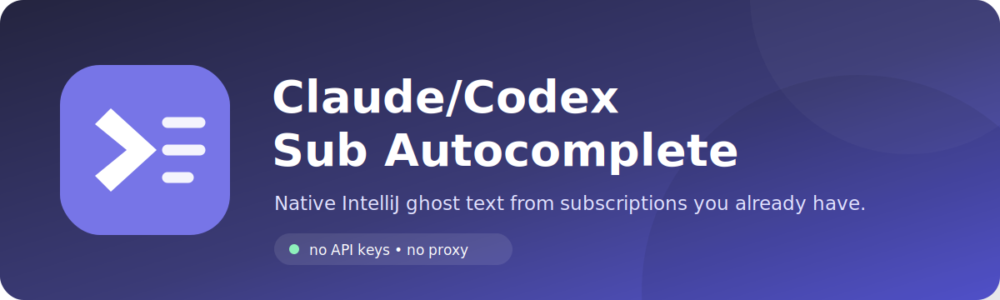
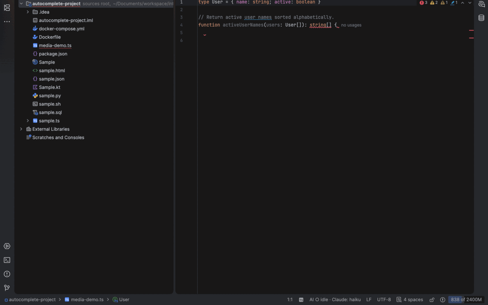
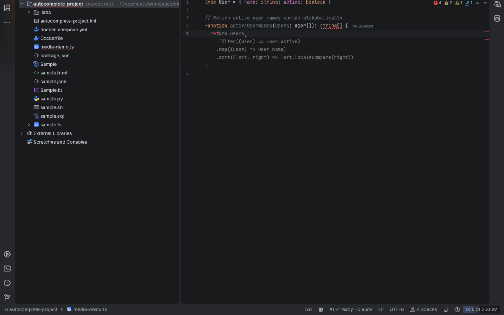
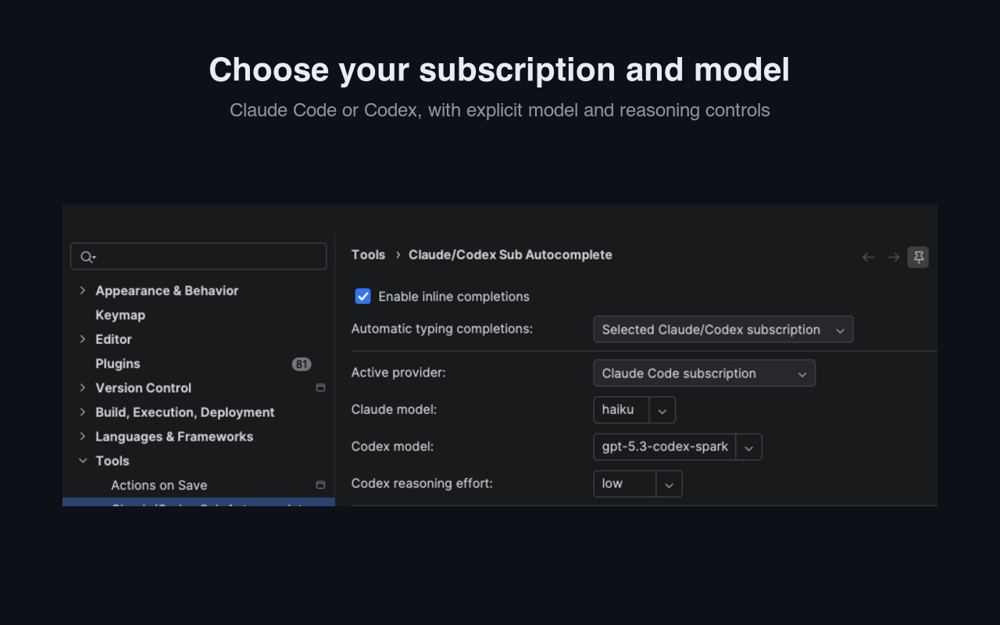
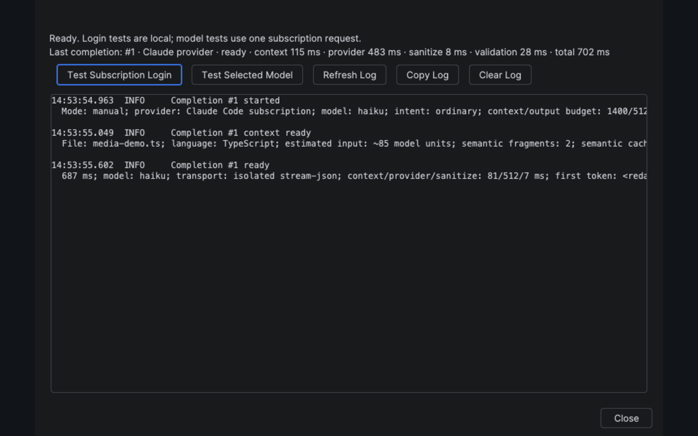

<p align="center">
  
</p>

<p align="center">
  <a href="https://github.com/kkoemets/claude-codex-sub-autocomplete/releases/latest"></a>
  
  <a href="LICENSE"></a>
  
</p>

Native IntelliJ autocomplete using the Claude Code or Codex subscription you already have—no API keys or separate autocomplete plan.

The plugin turns an authenticated provider CLI into IntelliJ ghost text. It gathers bounded editor context, asks the selected model for insertion-only code, validates the result, and renders it through IntelliJ's native inline-completion UI.

<p align="center">
  
</p>

## Why this exists

Claude Code and Codex are excellent at understanding code, but their agent interfaces interrupt the small, continuous completions that happen while editing. This plugin provides that missing inline path while keeping authentication and billing on the subscriptions you already control.

- Switch explicitly between Claude Code and Codex.
- Choose a model exposed by your subscription.
- Complete expressions, blocks, and comment-directed implementations.
- Trigger manually with <kbd>Alt</kbd>+<kbd>\</kbd>, or opt into automatic completion.
- Reuse compatible recent suggestion tails without another provider request.
- Include bounded recent-edit, open-tab, or cross-file context only when you enable it.
- Inspect provider activity, latency, connection state, and safe error details from the status bar.
- Preview related cross-file edits without applying them automatically.

<table>
  <tr>
    <td></td>
    <td></td>
  </tr>
  <tr>
    <td align="center"><sub>Native single-line and multiline ghost text</sub></td>
    <td align="center"><sub>Explicit provider, model, and context controls</sub></td>
  </tr>
</table>

<p align="center">
  
  <br>
  <sub>Connectivity checks, request progress, latency, and actionable failures</sub>
</p>

## Requirements

- IntelliJ IDEA Community or Ultimate 2026.1 or newer.
- Java 21, included with current IntelliJ IDEA releases.
- Claude Code or Codex CLI installed and authenticated through a supported subscription.

For Claude Code:

```bash
claude auth login
claude auth status
```

For Codex:

```bash
codex login
codex login status
```

API-key authentication is intentionally rejected. A connection test reports when a CLI is missing, signed out, or using an unsupported authentication path.

## Install in 60 seconds

1. Download the latest ZIP from [GitHub Releases](https://github.com/kkoemets/claude-codex-sub-autocomplete/releases/latest).
2. Open **Settings → Plugins → gear icon → Install Plugin from Disk**.
3. Select the ZIP and restart IntelliJ IDEA if requested.
4. Open **Settings → Tools → Claude/Codex Sub Autocomplete**.
5. Select Claude or Codex, choose a model, and run **Connection Tests and Diagnostics**.
6. In an editor, press <kbd>Alt</kbd>+<kbd>\</kbd> to request a completion.

The `AI` status-bar entry shows the selected provider and current activity. Its menu provides the quickest path to manual completion, diagnostics, and settings.

## Language-aware context

Dedicated context adapters cover Java, Kotlin, Groovy, Scala, JavaScript, TypeScript, JSX/TSX, Vue, Svelte, Python, Bash and other shell files, YAML, Docker Compose, SQL, HTML, XML, JSON, CSS/SCSS/Less, TOML, properties, INI, `.env`, and Markdown. Other IntelliJ-supported languages receive bounded generic context.

Context is selected by relevance and size rather than copying the repository. The plugin never sends Git history, deleted text, every open file, or the whole project.

## Privacy and safety

Requests travel directly through the locally installed provider CLI. This project does not operate a proxy or telemetry service.

- No API keys or direct API billing.
- No analytics, telemetry, prompt collection, or completion collection.
- Provider tools, project inspection, file writes, and command execution are disabled.
- Common credential patterns are redacted before a request is sent.
- Diagnostics contain operational metadata, not source code or prompts.
- Automatic completion, recent-edit context, open-tab context, and cross-file context are off by default.
- Provider or model failures are shown instead of silently changing provider, model, or billing method.

See the [Privacy Policy](PRIVACY.md) and [End User License Agreement](EULA.md) for the complete public terms.

## Limitations

Claude Code and Codex use agent models rather than purpose-built fill-in-the-middle models. An uncached suggestion can take several seconds, and quality depends on the selected model and available context. Automatic completion can also consume subscription allowance quickly; manual completion is the practical default for slower models.

The plugin does not provide chat, autonomous editing, repository-wide semantic search, or automatic multi-file changes. Related cross-file suggestions remain read-only previews.

## Troubleshooting

### Nothing appears

- Confirm **Enable inline completions** is checked.
- Use <kbd>Alt</kbd>+<kbd>\</kbd> to separate provider latency from automatic-trigger pacing.
- Open the status-bar menu and run **Connection Tests and Diagnostics**.
- Check that IntelliJ IDEA can find `claude` or `codex` in the environment it was launched with.

### Subscription login fails

Run the provider's login-status command in a terminal, then restart IntelliJ IDEA if the CLI was installed or authenticated after the IDE started. API-key login is not accepted on either provider path.

### A completion stops early or is rejected

Increase **Approximate completion size** only when the requested implementation genuinely needs more output. The plugin rejects incomplete or structurally unsafe responses instead of inserting a partial block.

For additional help, read [Support](SUPPORT.md) or open a bug report with diagnostics that do not contain private code.

## Development

```bash
./gradlew test
./gradlew autocompleteDeterministicEval
./gradlew buildPlugin
./gradlew verifyPlugin
```

The complete pre-release check is:

```bash
./gradlew clean autocompleteReleaseGate --no-daemon
```

Install the resulting ZIP from `build/distributions/`. See [Contributing](CONTRIBUTING.md) for development conventions and [Releasing](RELEASING.md) for the credentialed local signing and Marketplace workflow.

## License and trademarks

Released under the [MIT License](LICENSE).

This is an independent project and is not affiliated with Anthropic, OpenAI, or JetBrains. Claude and Claude Code are trademarks of Anthropic. Codex and OpenAI are trademarks of OpenAI. IntelliJ IDEA and JetBrains are trademarks of JetBrains s.r.o. Third-party names identify compatible services and do not imply endorsement.
