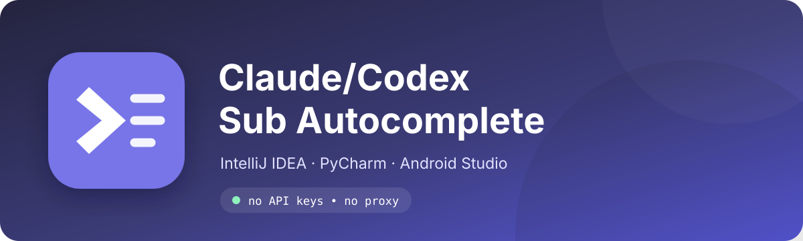
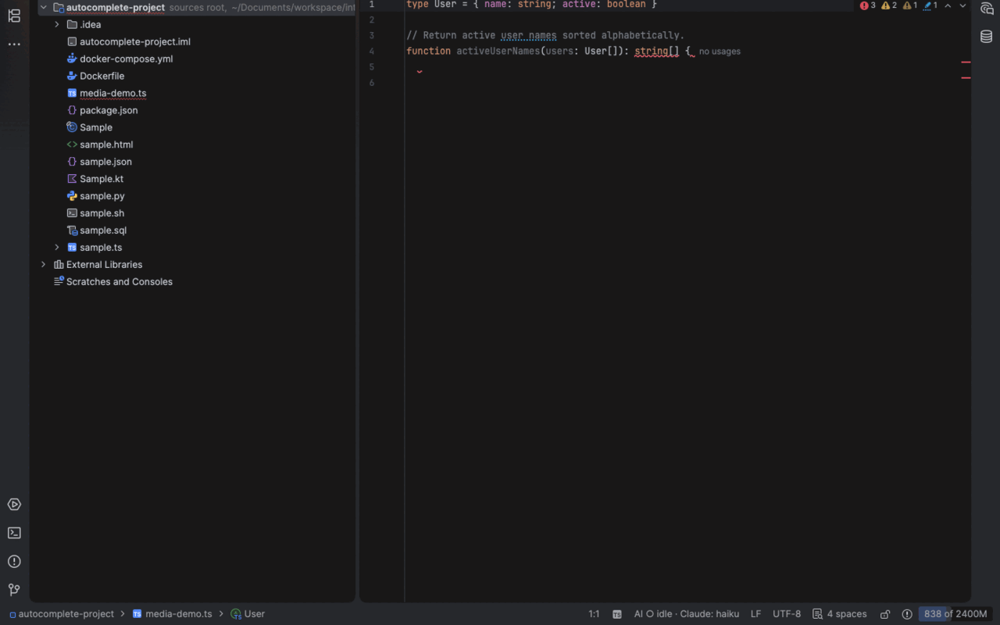
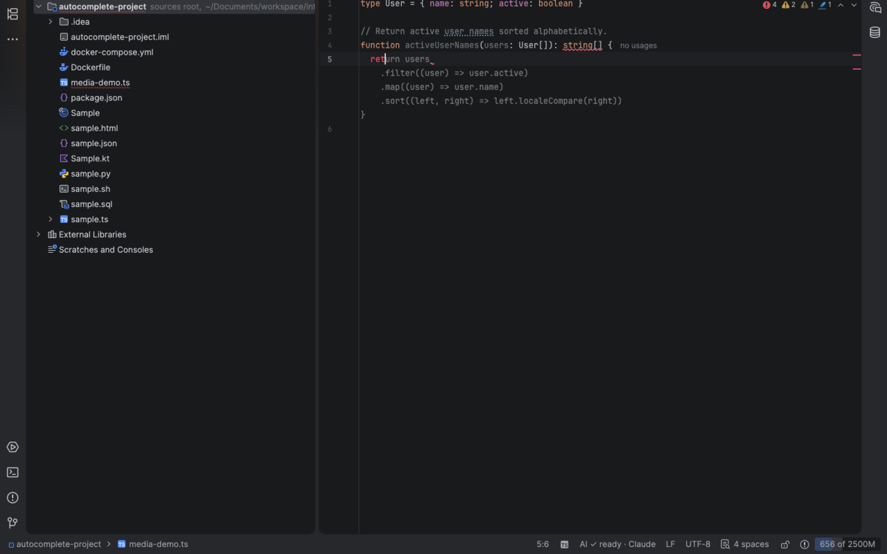
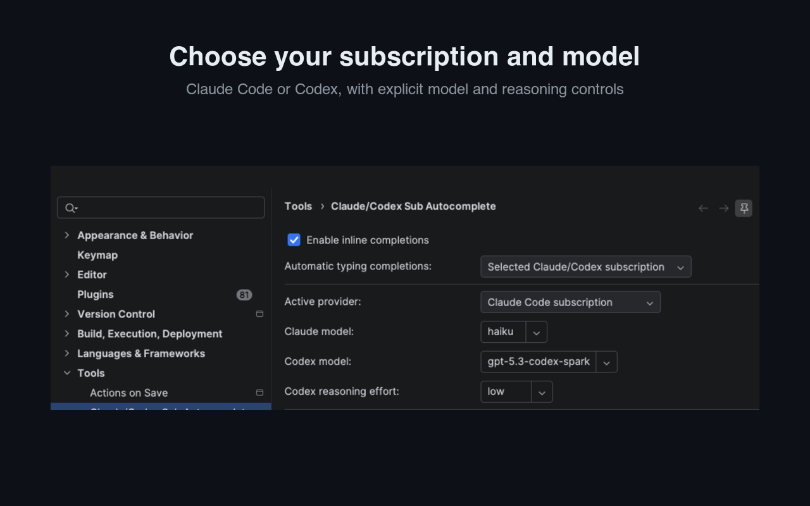
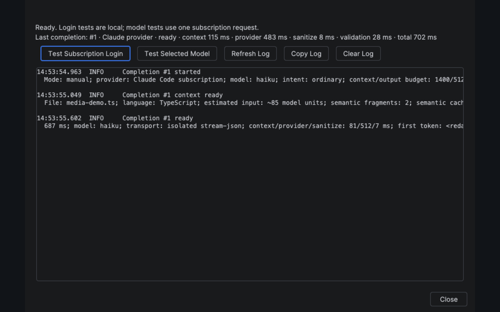

<p align="center">
  
</p>

<p align="center">
  <a href="https://github.com/kkoemets/claude-codex-sub-autocomplete/releases/latest"></a>
  
  
  
  <a href="LICENSE"></a>
  
</p>

Native autocomplete for IntelliJ IDEA, PyCharm, and Android Studio using the Claude Code or Codex subscription you already have—no API keys or separate autocomplete plan.

The plugin turns an authenticated provider CLI into native ghost text in your IDE. It gathers bounded editor context, asks the selected model for insertion-only code, validates the result, and renders it through the IDE's native inline-completion UI.

<p align="center">
  
</p>

## Why this exists

Claude Code and Codex are excellent at understanding code, but their agent interfaces interrupt the small, continuous completions that happen while editing. This plugin provides that missing inline path while keeping authentication and billing on the subscriptions you already control.

- Switch explicitly between Claude Code and Codex.
- Choose a model exposed by your subscription.
- Complete expressions, blocks, and comment-directed implementations.
- Get automatic completions as you type, or request one manually with <kbd>Alt</kbd>+<kbd>\</kbd>.
- Turn a <code># request</code> into a reviewable command with <kbd>Tab</kbd> in your IDE's terminal.
- Reuse compatible recent suggestion tails without another provider request.
- Include bounded recent-edit, open-tab, or cross-file context only when you enable it.
- Inspect provider activity, latency, connection state, and safe error details from the status bar.
- Preview related cross-file edits without applying them automatically.

<table>
  <tr>
    <td></td>
    <td></td>
  </tr>
  <tr>
    <td align="center"><sub>Native single-line and multiline ghost text</sub></td>
    <td align="center"><sub>Explicit provider, model, and context controls</sub></td>
  </tr>
</table>

<p align="center">
  
  <br>
  <sub>Connectivity checks, request progress, latency, and actionable failures</sub>
</p>

## Requirements

Version 0.6.4 supports IntelliJ IDEA, PyCharm, and Android Studio with one signed ZIP.
See [compatibility and validation](docs/compatibility.md) for verified builds and coverage.

- IntelliJ IDEA or PyCharm 2025.3 or newer, or Android Studio Quail 4 (2026.1.4).
- The IDE's bundled Java runtime (Java 21 or newer).
- The bundled Terminal plugin enabled.
- Claude Code or Codex CLI installed and authenticated through a supported subscription.

For Claude Code:

```bash
claude auth login
claude auth status
```

For Codex:

```bash
codex login
codex login status
```

API-key authentication is intentionally rejected. A connection test reports when a CLI is missing, signed out, or using an unsupported authentication path.

## Install in 60 seconds

1. Download the signed ZIP from [release 0.6.4](https://github.com/kkoemets/claude-codex-sub-autocomplete/releases/tag/v0.6.4). See [compatibility and artifact checksums](docs/compatibility.md) for verification details.
2. Open **Settings → Plugins → gear icon → Install Plugin from Disk**.
3. Select the ZIP and restart your IDE if requested.
4. Open **Settings → Tools → Claude/Codex Sub Autocomplete**.
5. Select Claude or Codex, choose a model, and run **Connection Tests and Diagnostics**.
6. Start typing in an editor for automatic suggestions, or press <kbd>Alt</kbd>+<kbd>\</kbd> to request a completion manually.

The `AI` status-bar entry shows the selected provider and current activity. Its menu provides the quickest path to manual completion, diagnostics, and settings.

One ZIP serves all supported IDEs. Android Studio uses its own release numbering;
compatibility follows its underlying IntelliJ Platform build. The plugin requires
build 253 or newer, but older Android Studio releases are not part of the maintained
test matrix. Language context uses the parsers available in your IDE.
See the [compatibility record](docs/compatibility.md) for exact builds and validation coverage.

Codex defaults to `gpt-5.6-luna` with `low` reasoning. Explicitly stored model and reasoning selections are retained. Configurations that omitted the previous default model use the new default.

Automatic completion from the selected subscription is enabled on first installation.
Existing automatic, hotkey-only, and disabled preferences are preserved. To use only the hotkey, set **Automatic typing completions**
to **Off — hotkey only** in the plugin settings. A supported CLI must be installed and authenticated
before it can generate suggestions.

## Terminal commands

The plugin works in the IDE's classic and Reworked terminals. At an empty shell prompt, type a request such as:

```text
# list the ten largest TypeScript files
```

Press <kbd>Tab</kbd>. The selected Claude or Codex model replaces that request with one shell command. Review it, then press <kbd>Enter</kbd> yourself if it is correct. The plugin never submits or executes the generated command.

Reworked terminal generation requires shell integration and an idle shell prompt. It stays inactive while a program is running or terminal search has focus.

Terminal generation is deliberately narrow in this release: the request and result must each fit on one physical line, and ordinary Tab behavior is unchanged unless the current input starts with `#` followed by at least three characters. Enable or disable it independently in plugin settings or from the `AI` status menu.

## Language-aware context

Dedicated context adapters cover Java, Kotlin, Groovy, Scala, JavaScript, TypeScript, JSX/TSX, Vue, Svelte, Python, Bash and other shell files, YAML, Docker Compose, SQL, HTML, XML, JSON, CSS/SCSS/Less, TOML, properties, INI, `.env`, and Markdown. Other languages available in your IDE receive bounded generic context.

Context is selected by relevance and size rather than copying the repository. The plugin never sends Git history, deleted text, every open file, or the whole project.

## Privacy and safety

Requests travel directly through the locally installed provider CLI. This project does not operate a proxy or telemetry service.

- No API keys or direct API billing.
- No analytics, telemetry, prompt collection, or completion collection.
- Provider tools, project inspection, file writes, and command execution are disabled.
- Terminal requests send only the typed request, shell name, coarse operating-system family, working directory, project name, and detected project-marker names. Terminal history, output, and file contents are not included.
- Common credential patterns are redacted before a request is sent.
- Diagnostics contain operational metadata, not source code or prompts.
- Automatic completion is enabled on first installation; you can switch it off in settings. Recent-edit, open-tab, and cross-file context remain off by default.
- Provider or model failures are shown instead of silently changing provider, model, or billing method.

See the [Privacy Policy](PRIVACY.md) and [End User License Agreement](EULA.md) for the complete public terms.

## Limitations

Claude Code and Codex use agent models rather than purpose-built fill-in-the-middle models. An uncached suggestion can take several seconds, and quality depends on the selected model and available context. Automatic completion uses subscription allowance; switch to hotkey-only mode if you prefer to control when requests are sent.

The plugin does not provide chat, autonomous editing, repository-wide semantic search, or automatic multi-file changes. Related cross-file suggestions remain read-only previews. Terminal generation currently produces one command line at a time.

## Troubleshooting

### Nothing appears

- Confirm **Enable Claude/Codex completions** is checked.
- Use <kbd>Alt</kbd>+<kbd>\</kbd> to separate provider latency from automatic-trigger pacing.
- Open the status-bar menu and run **Connection Tests and Diagnostics**.
- Check that your IDE can find `claude` or `codex` in the environment it was launched with.

### Subscription login fails

Run the provider's login-status command in a terminal, then restart your IDE if the CLI was installed or authenticated after the IDE started. API-key login is not accepted on either provider path.

### `# request` + Tab does nothing in the terminal

- Confirm **Enable terminal commands (# request + Tab)** is enabled.
- Open diagnostics and confirm **Terminal Tab integration attached** appears. It supports both classic and Reworked Terminal sessions.
- Start the current command line with `#` and provide at least three descriptive characters.
- Wait for the shell prompt to be ready; the action intentionally does not run while another command is active.

### A completion stops early or is rejected

Increase **Approximate completion size** only when the requested implementation genuinely needs more output. The plugin rejects incomplete or structurally unsafe responses instead of inserting a partial block.

For additional help, read [Support](SUPPORT.md) or open a bug report with diagnostics that do not contain private code.

## Development

```bash
./gradlew test
./gradlew autocompleteDeterministicEval
./gradlew terminalDeterministicEval
./gradlew terminalLiveEval
./gradlew buildPlugin
./gradlew verifyPlugin
```

`terminalLiveEval` is the explicit network-backed quality gate: it runs one shared
50-case suite against Claude Haiku and Codex `gpt-5.6-luna`, with Codex reasoning set to `low`.
It requires at least 90% from each provider and targets 92% or better. It does not
open or control an IDE.

The complete headless pre-release check is:

```bash
./gradlew clean autocompleteReleaseGate --no-daemon
```

The real-IDE smoke tests are separate because they open and control IDE windows.
On a shared computer, run them in Docker with a private virtual display so they
do not take desktop focus:

```bash
./scripts/test-isolated-ides.sh /absolute/path/to/plugin.zip
```

This runs the installed Linux versions of all three IDEs. See [Contributing](CONTRIBUTING.md)
for prerequisites and coverage limits. On a dedicated desktop, this native task
targets IntelliJ IDEA and takes keyboard focus:

```bash
./gradlew autocompleteInstalledIdeTest --no-daemon
```

The same installed-plugin checks can target PyCharm or Android Studio, or run
sequentially in all three products:

```bash
./gradlew autocompleteInstalledPyCharmTest --no-daemon
./gradlew autocompleteInstalledAndroidStudioTest --no-daemon
./gradlew autocompleteCrossIdeTest --no-daemon
```

Install the resulting ZIP from `build/distributions/`. See [Contributing](CONTRIBUTING.md) for development conventions and [Releasing](RELEASING.md) for the credentialed local signing and Marketplace workflow.

## License and trademarks

Released under the [MIT License](LICENSE).

This is an independent project and is not affiliated with Anthropic, OpenAI, or JetBrains. Claude and Claude Code are trademarks of Anthropic. Codex and OpenAI are trademarks of OpenAI. IntelliJ IDEA and JetBrains are trademarks of JetBrains s.r.o. Third-party names identify compatible services and do not imply endorsement.
